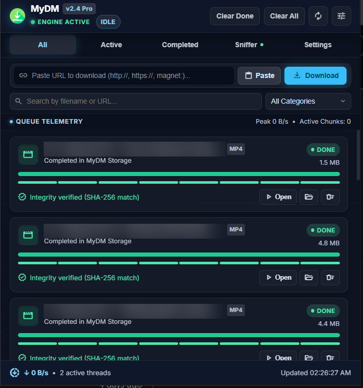
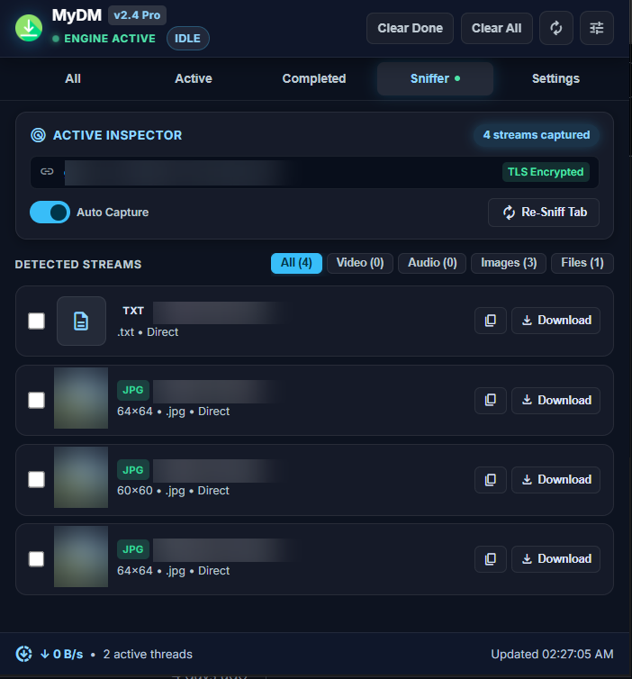
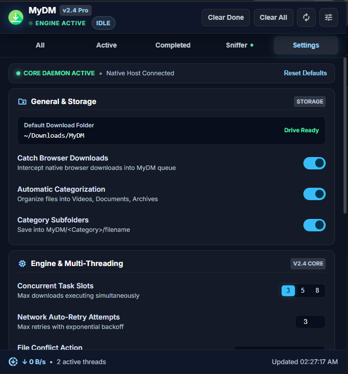

# MyDM - Modern Browser-Native Download Manager

A high-performance, browser-native download manager for Chrome and Edge (Manifest V3) inspired by Internet Download Manager (IDM), engineered with an emphasis on reliability, security, smart media detection, queue management, and automatic categorization.

---

## 📸 Interface Preview

<div align="center">

### ⚡ Cyber Telemetry Downloads Dashboard
*Live 8-thread multi-segment chunk tracks, rolling speed telemetry, category tags, and integrity verification.*



<br/>

### 🔍 Media Sniffer & Tactical Stream Inspector
*Real-time stream manifest detection (HLS/DASH/Direct), multi-select batch queueing, and one-click capture.*



<br/>

### ⚙️ Engine & Bento Settings Preferences
*Customizable concurrent slots (3, 5, 8), subfolder categorization, FFmpeg merging, and audio completion cues.*



</div>

---

## 🚀 Key Features

- **Browser-Only Ready**: Works immediately out of the box without requiring external desktop software or Python environments.
- **Cyber Telemetry Dark UI (v2.4 Pro)**:
  - Custom glassmorphic telemetry theme with pulsing engine heartbeat indicators.
  - Live aggregate queue speed banner and active thread chunk monitors.
  - Zero-XSS DOM rendering with strict attribute and textContent sanitization.
- **8-Thread Multi-Segment Visualization**:
  - Live visualization tracks showing real-time slice progression across concurrent threads.
  - Finished slices glow in emerald green, active downloading slices pulse in cyber cyan, and pending slices queue cleanly.
- **Deterministic State Machine**: Strict 12-state lifecycle (`QUEUED`, `STARTING`, `DOWNLOADING`, `PAUSING`, `PAUSED`, `RESUMING`, `COMPLETING`, `COMPLETED`, `CANCELLING`, `CANCELLED`, `RETRYING`, `FAILED`).
- **Smart Concurrency Queue**: Configure maximum parallel downloads via quick segmented controls (3, 5, 8 slots). Excess downloads queue automatically and start as slots free up.
- **Reliable Pause & Resume**: True pause and resume backed by the browser's C++ network engine and HTTP Range headers.
- **Intelligent Retry System**: Automatically recovers from transient network drops and server timeouts (408, 429, 5xx) with bounded exponential backoff and randomized jitter.
- **Filename Intelligence & Security**:
  - RFC 5987 / 6266 `filename*=UTF-8''...` and quoted `filename="..."` extraction.
  - Path traversal protection (`..`, leading slashes, drive letters).
  - Sanitization of Windows reserved device names (`CON`, `PRN`, `AUX`, `NUL`, `COM1-9`, `LPT1-9`).
- **Automatic Categorization & Subfolders**:
  - Automatically sorts into **Documents**, **Images**, **Videos**, **Audio**, **Archives**, **Programs**, **ISOs**, and **Other**.
  - Routes files into organized subfolders (e.g., `Downloads/MyDM/Videos/sample.mp4`).
- **Active Inspector & Media Sniffer**:
  - Content script detects `<video>`, `<audio>`, embedded sources, and HLS (`.m3u8`) / DASH (`.mpd`) stream manifests on the active webpage.
  - Multi-select checkboxes with a **Tactical Batch Action Strip** for instant batch link copying or bulk download queuing.
- **Accurate Rolling-Window Speed & ETA**:
  - Stable rolling measurement (3-second window) prevents erratic speed spikes.
  - Honest progress tracking (no fabricated percentages when total size is unknown).
- **Web Audio API Feedback**:
  - Synthesized dual-tone audio completion chime on finished downloads without external audio assets.
- **Optional Native Host Support**: Retains full compatibility with the optional Python segmented / yt-dlp backend for advanced workflows.

---

## 📋 Project Structure

```text
MyDM/
├── docs/
│   └── screenshots/               # UI Interface screenshots for documentation
│       ├── downloads_dashboard.png
│       ├── media_sniffer.png
│       └── settings_preferences.png
├── extension/
│   ├── manifest.json              # Chrome/Edge MV3 Extension Manifest
│   ├── background.js              # Service Worker & download orchestrator
│   ├── content.js                 # Content script for page media sniffing
│   ├── popup.html                 # Cyber Telemetry UI popup interface
│   ├── popup.js                   # Popup controller & state sync
│   ├── icon48.png                 # Extension icon
│   └── engine/                    # Core browser engine modules
│       ├── state_machine.js       # Lifecycle state machine & transition rules
│       ├── filename_util.js       # Filename resolution & sanitization
│       ├── rules_engine.js        # Categorization & directory routing
│       ├── speed_tracker.js       # Rolling speed & ETA calculation
│       ├── download_store.js      # Authoritative state store (chrome.storage.local)
│       └── download_manager.js    # Concurrency queue & browser download driver
├── python_app/                    # Optional native messaging host
│   ├── mydm_host.py               # Python native messaging host
│   ├── downloader.py              # Segmented downloader & streaming manager
│   ├── com.mydm.native.json       # Native host manifest configuration
│   └── start_host.bat             # Windows native host launcher
├── scripts/
│   └── check_js_syntax.js         # JavaScript compilation syntax checker
├── tests/                         # Comprehensive automated test suite
│   ├── test_extension_modules.js  # Node.js test suite for extension engine
│   ├── test_js_suite.py           # Pytest runner for JavaScript tests
│   ├── test_downloader.py         # Downloader module tests
│   ├── test_streaming_manager.py  # Streaming manager & yt-dlp tests
│   ├── test_native_host.py        # Native messaging host framing & routing tests
│   ├── test_sanitize_filename.py  # Filename sanitization & reserved name tests
│   ├── test_extension_manifest.py # MV3 manifest validation tests
│   └── test_live_download_server.py # Live HTTP server tests with Range requests
└── README.md
```

---

## ⚙️ Quick Start (Browser-Only Extension)

No Python or administrative setup is required for standard browser usage!

1. Open **Google Chrome** or **Microsoft Edge**.
2. Navigate to `chrome://extensions/` (or `edge://extensions/`).
3. Toggle on **Developer mode** in the upper-right corner.
4. Click **Load unpacked**.
5. Select the `extension/` directory inside this repository.
6. The **MyDM** icon will appear in your browser toolbar!

### How to Use
- **Right-Click**: Right-click any link, image, audio, or video and select **"Download with MyDM"**.
- **Popup Input**: Click the MyDM toolbar icon, paste any URL, or click **"Paste"**, then click **Download**.
- **Media Sniffer**: Switch to the **Sniffer** tab in the popup to inspect detectable media streams and manifests on the active webpage, select multiple streams, and batch-download them.
- **Controls**: Pause, resume, cancel, retry, or reveal completed downloads in your folder directly from the popup cards.
- **Settings**: Switch to **Settings** to adjust concurrent slots (3, 5, 8), toggle auto-categorization subfolders, manage protocol sniffing, and export your configuration JSON.

---

## 🔌 Optional: Python Native Host Setup

If you wish to enable the optional native Python backend (for segmented multi-threaded downloading and yt-dlp video extraction):

1. **Install Python 3.7+** and ensure it is on your `PATH`.
2. **Install Python dependencies:**
   ```powershell
   python -m pip install -r requirements.txt
   ```
3. **Register the Native Host in Windows Registry:**
   Run PowerShell as Administrator:
   ```powershell
   .\FIX_REGISTRY.ps1
   ```
   *(When prompted, enter your 32-character Extension ID from `chrome://extensions/`)*

---

## 🧪 Automated Testing

MyDM includes a test suite covering state transitions, filename sanitization, queue scheduling, retry backoff, native host protocol framing, and live HTTP Range downloads.

### Run All Tests via Pytest:
```powershell
pytest -v
```

### Run Extension Engine Unit Tests via Node.js:
```powershell
node tests/test_extension_modules.js
```

### Verify JavaScript Syntax across all Extension Files:
```powershell
node scripts/check_js_syntax.js extension/background.js extension/content.js extension/popup.js extension/engine/*.js
```

---

## 🛡️ Security & Privacy

- **Local-Only**: MyDM performs all download management locally on your machine. No analytics, tracking, or remote telemetry are collected.
- **Strict Content Security**: No `eval()` or dynamic code execution. All UI components are rendered using sanitized DOM elements.
- **Path Traversal Guard**: Prevents malicious remote resources from writing outside the browser's download directory.
- **Ethical Downloading**: Respects platform access controls and does not circumvent digital rights management (DRM).

---

## 📄 License

MIT License.
